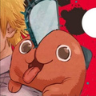

# markdown作业

## 电锯人漫画观后感

>藤本恶魔

&ensp;&ensp;此番包含 青春、暴力、擦边、宗教、虚无主义、~~败血~~、~~汉尼拔~~、~~嗑药画面~~

个人探究：
### 玛奇玛マキマ
！[maqima](https://c-ssl.duitang.com/uploads/blog/202012/24/20201224172833_0d845.jpg)
人物塑造相当完整，去掉キ即为妈妈的意思，说明这个角色一方面具备母性关怀同时又有母亲的支配感。虽有着强大力量却平易近人，看透一切却保持沉默的东方女性特有性格。是区别于主角破坏这一主题的，稳定和秩序的代表。通篇与电次的关系实现了从养育到全面控制的转变。在前半段，作者是创造了一个勾引小弟弟的神秘坏女人形象，而后半段交代了其能力和动机，前后的转变还是有些生硬的。
批判：把玛奇玛变坏的理由完全归结于缺爱很单薄，还有最后奇葩的死法，很像是想不到一个很好的交代开始放飞自我~~太猎奇了~~
### 秋 aki
这个角色，名字来源于ak47....~~屌嘞~~。工具式角色，所代表意象：组长和武士（团体阶级和身份暗示）、狐狸恶魔（纯粹容易被骗）、兄长（完全为电次产生了爱这一主题服务）、姬野之死（让读者产生不再有爱并为后续有爱又被所爱之人杀死这一情节服务）
批判：卡卡西了，本部唯一一个没有黑历史的人，跟其他人显得不搭。
### 帕瓦
很有意思，下次再写